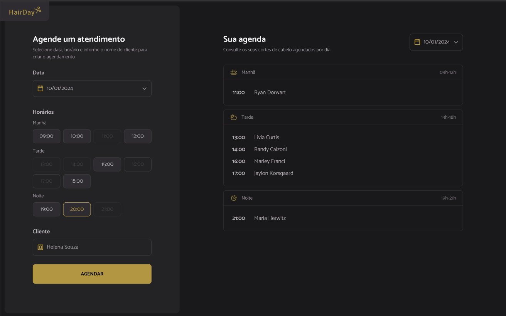

# 💇‍♀️ HairDay


> Projeto prático da formação **FullStack** da [Rocketseat](https://www.rocketseat.com.br/).  
> Aplicação web de agendamento para corte de cabelo.

---

## 📸 Demonstração



---

## 📄 Sobre o projeto

**HairDay** é uma aplicação web de **agendamento para cortes de cabelo**, desenvolvida como parte prática da formação **Fullstack** da [Rocketseat](https://www.rocketseat.com.br/).  
O projeto tem como objetivo aplicar conceitos de **JavaScript modular**, manipulação de **DOM**, consumo de **JSON Server**, e integração de múltiplos módulos através do **Webpack**.

> ⚠️ O layout não foi idealizado nem desenvolvido por mim, porém toda a **lógica da aplicação** foi implementada por mim, **Pollyana Valverde**.

**🧠 Funcionalidades**

O HairDay permite que o usuário:
- Escolha uma **data** e **horário disponível** para o atendimento;
- Informe o **nome do cliente**;
- Visualize os **agendamentos cadastrados**, organizados por período do dia (manhã, tarde e noite);
- Remova agendamentos existentes;
- Tudo isso com persistência simulada via **JSON Server**.

O foco do projeto é o **JavaScript puro**, com ênfase em boas práticas de **modularização, separação de responsabilidades** e **comunicação assíncrona com API local**.

---

## 🧩 Tecnologias Utilizadas

- **JavaScript (ES6+)**
- **Webpack**
- **Babel**
- **JSON Server**
- **Day.js**
- **CSS Loader / Style Loader**
- **HTML Webpack Plugin**

---

## ⚙️ Estrutura do Projeto

```
hairday/
├── dist/
│   ├── src/
│   ├── index.html
│   ├── main.js
│   └── scissors.svg
├── src/
│   ├── assets/
│   ├── libs/
│   ├── modules/
│   │   ├── form/
│   │   ├── schedules/
│   │   └── page-load.js
│   ├── services/
│   ├── styles/
│   ├── utils/
│   └── main.js
├── server.json
├── package.json
├── webpack.config.js
└── README.md
```

---

## 🚀 Como Executar

1. **Clone o repositório**
   ```bash
   git clone https://github.com/pollyana-valverde/Hairday.git
   cd Hairday
   ```

2. **Instale as dependências**
   ```bash
   npm install
   ```

3. **Inicie o servidor JSON**
   ```bash
   npm run server
   ```

4. **Execute o ambiente de desenvolvimento**
   ```bash
   npm run dev
   ```

O projeto será aberto em:  
👉 `http://localhost:3000`  
O servidor JSON rodará em:  
👉 `http://localhost:3333`

---

## 📚 Aprendizados

Durante o desenvolvimento deste projeto, trabalhei com:
- Estruturação de um projeto JavaScript modular;
- Configuração de **Webpack** e **Babel** do zero;
- Simulação de API com **JSON Server**;
- Manipulação dinâmica do DOM com base em dados da API;
- Separação de responsabilidades entre **módulos, serviços e utilitários**.

---

## 👩‍💻 Autora

Feito por Pollyana Valverde
.
Projeto proposto pela Rocketseat
.